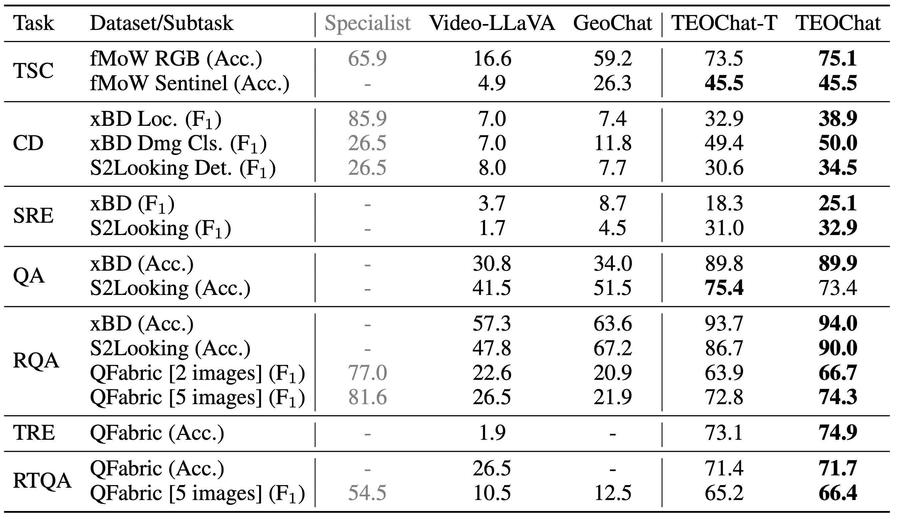
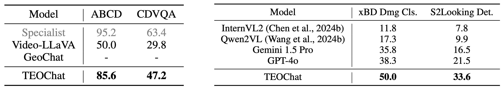
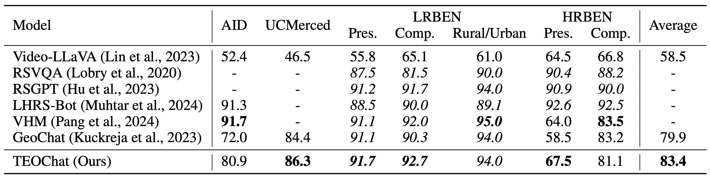

<p align="center">
    
<p>
<h2 align="center"> <a href="http://arxiv.org/abs/2410.06234">TEOChat: Large Language and Vision Assistant for Temporal Earth Observation Data</a></h2>
<h5 align="center"> If you like our project, please give us a star ⭐ on GitHub for latest update.  </h2>


<h5 align="center">
    
[](https://huggingface.co/datasets/jirvin16/TEOChatlas)
[](https://huggingface.co/jirvin16/TEOChat)
[](https://huggingface.co/spaces/jirvin16/TEOChat)  <br>
[](http://arxiv.org/abs/2410.06234)
[](https://github.com/ermongroup/TEOChat/blob/main/LICENSE)
[](https://hits.seeyoufarm.com)

</h5>

## 📰 News
* **[2024.11.11]** 🎉 The [TEOChatlas Dataset](https://huggingface.co/datasets/jirvin16/TEOChatlas) is now available, along with model training code with instructions described in [TRAIN_AND_VALIDATE.md](TRAIN_AND_VALIDATE.md)! Validation code and instructions will be provided soon.
* **[2024.10.9]** 👀 [Paper](https://arxiv.org/abs/2410.06234), [TEOChat Model](https://huggingface.co/jirvin16/TEOChat), and 🤗 [Hugging Face demo](https://huggingface.co/spaces/jirvin16/TEOChat) are available! Please feel free to **watch** 👀 this repository for the latest updates.

## Table of Contents

* [Highlights](#-highlights)
* [Demo](#-demo)
* [Main Results](#-main-results)
* [Requirements and Installation](#%EF%B8%8F-requirements-and-installation)
* [Training & Validating](#%EF%B8%8F-training--validating)
* [License](#-license)
* [Acknowledgement](#-acknowledgement)
* [Citation](#%EF%B8%8F-citation)

## 😮 Highlights 

**TEOChat** is the first language and vision assistant that can engage in conversation about sequences of temporal earth observation imagery, and exhibits impressive performance on multiple temporal instruction-following tasks.


### 📚 TEOChatlas: A new instruction-following dataset for temporal EO data
We introduce a new instruction-following dataset for temporal EO data called **TEOChatlas** which we use to train TEOChat. TEOChatlas contains 554,071 examples spanning dozens of temporal instruction-following tasks.


### 🤖 TEOChat: A new vision-language model for temporal EO data
We design TEOChat to use a LLaVA-style architecture, combining a temporally shared vision encoder with a LLaMA 2 LLM connected through an MLP vision-language projector


## 🤗 Demo

### Gradio Web UI

We provide an [online demo](https://huggingface.co/spaces/jirvin16/TEOChat) in Huggingface Spaces.

You can also run the demo locally by running the following command:
```bash
python videollava/serve/teochat_demo.py 
```


## 🚀 Main Results
We demonstrate that TEOChat:
- outperforms a previous VLM for single EO images ([GeoChat](https://github.com/mbzuai-oryx/geochat)) and a VLM for temporal sequences of natural images ([Video-LLaVA](https://github.com/PKU-YuanGroup/Video-LLaVA)), and also rivals specialist models on multiple tasks.
- achieves impressive zero-shot performance on an EO change detection and a change QA dataset.
- outperforms two strong proprietary foundation models for modeling sequences of images (GPT-4o and Gemini-1.5 Pro).
- possesses strong single image capabilities, outperforming GeoChat on multiple zero-shot scene classification and visual question answering tasks.

### Temporal Tasks
<p align="left">

</p>

### Zero-shot Temporal Tasks and Comparison with Proprietary Foundation Models
<p align="left">

</p>

### Single Image Tasks
<p align="left">

</p>


## 🛠️ Requirements and Installation
* Python >= 3.9
* Pytorch == 2.2.1
* CUDA Version >= 12.1
* Install required packages:
```bash
git clone https://github.com/ermongroup/TEOChat.git
cd TEOChat
conda create -n teochat python=3.9 -y
conda activate teochat
pip install --upgrade pip  # enable PEP 660 support
pip install -e .
pip install git+https://github.com/facebookresearch/pytorchvideo
```

## 🗝️ Training & Validating
The training & validating instructions, including how to download the TEOChatlas dataset, are in [TRAIN_AND_VALIDATE.md](TRAIN_AND_VALIDATE.md).

## 👍 Acknowledgement
* [Video-LLaVA](https://github.com/PKU-YuanGroup/Video-LLaVA) The codebase and model we built upon.
* [GeoChat](https://github.com/mbzuai-oryx/geochat) The single image instruction-following dataset we included in TEOChatlas.

## 🔒 License
* The majority of this project is released under the Apache 2.0 license as found in the [LICENSE](https://github.com/ermongroup/TEOChat/blob/main/LICENSE) file.
* The service is a research preview intended for non-commercial use only, subject to the model [License](https://github.com/facebookresearch/llama/blob/main/MODEL_CARD.md) of LLaMA, [Terms of Use](https://openai.com/policies/terms-of-use) of the data generated by OpenAI, and [Privacy Practices](https://chrome.google.com/webstore/detail/sharegpt-share-your-chatg/daiacboceoaocpibfodeljbdfacokfjb) of ShareGPT. Please contact us if you find any potential violation.

## ✏️ Citation
If you find our paper and code useful in your research, please consider giving a star :star: and citation :pencil:.

```BibTeX
@article{irvin2024teochat,
  title={TEOChat: A Large Vision-Language Assistant for Temporal Earth Observation Data},
  author={Irvin, Jeremy Andrew and Liu, Emily Ruoyu and Chen, Joyce Chuyi and Dormoy, Ines and Kim, Jinyoung and Khanna, Samar and Zheng, Zhuo and Ermon, Stefano},
  journal={arXiv preprint arXiv:2410.06234},
  year={2024}
}
```
